# Análise de Sentimentos em Críticas de Cinema com Dados Sintéticos Gerados por LLMs

**Documento-base para escrita do artigo (formato SBC) e montagem da apresentação.**
Contém todas as seções expandidas, tabelas com resultados, referências às figuras geradas e fundamentação teórica. Os valores de métricas são aproximados (~) pois variam levemente a cada execução.

---

## 1. Introdução

A análise de sentimentos é uma das tarefas mais estudadas no Processamento de Linguagem Natural (PLN), com aplicações em monitoramento de redes sociais, avaliação de produtos, análise de opinião pública e sistemas de recomendação (Liu, 2012). O objetivo é classificar automaticamente um texto de acordo com a polaridade do sentimento expresso — tipicamente positivo, negativo ou neutro.

Um dos principais gargalos para o desenvolvimento de modelos de análise de sentimentos é a disponibilidade de dados rotulados de qualidade, especialmente para idiomas com menos recursos que o inglês, como o português brasileiro. A anotação manual de dados é um processo custoso, demorado e sujeito a inconsistências entre anotadores (Pang & Lee, 2008).

Com o surgimento dos grandes modelos de linguagem (Large Language Models — LLMs) como ChatGPT (OpenAI), Claude (Anthropic) e Gemini (Google), abriu-se uma alternativa: a geração de dados sintéticos rotulados. Trabalhos recentes demonstram que LLMs podem produzir datasets de qualidade competitiva para tarefas de classificação de texto (Li et al., 2023; Veselovsky et al., 2023), mas a maioria dos estudos foca no inglês e em domínios como notícias e redes sociais.

Este trabalho investiga a viabilidade de utilizar dados sintéticos gerados por três LLMs distintos para treinar classificadores de sentimento no domínio de críticas de cinema em português brasileiro. A escolha de múltiplos modelos geradores permite analisar não apenas o desempenho dos classificadores, mas também as diferenças qualitativas entre os textos produzidos por cada LLM — um aspecto pouco explorado na literatura.

As contribuições deste trabalho são:
1. Construção de um dataset sintético multiclasse (positivo, negativo, neutro) em português, gerado por três LLMs diferentes, totalizando 1798 frases;
2. Avaliação comparativa de três classificadores baseline (Naive Bayes, Regressão Logística e SVM Linear) com validação cruzada e curvas de aprendizado;
3. Análise qualitativa dos erros de classificação, identificando padrões de ambiguidade por fonte geradora.

---

## 2. Fundamentação Teórica

### 2.1 Análise de Sentimentos

A análise de sentimentos (ou mineração de opinião) é a tarefa computacional de identificar e extrair informações subjetivas de textos em linguagem natural (Liu, 2012). O problema pode ser abordado em diferentes granularidades: nível de documento, nível de sentença ou nível de aspecto. Neste trabalho, adota-se a classificação no nível de sentença com três classes: positiva, negativa e neutra.

As abordagens clássicas para análise de sentimentos incluem métodos baseados em léxicos (dicionários de palavras com polaridade associada) e métodos baseados em aprendizado de máquina supervisionado (Pang & Lee, 2008). Os métodos supervisionados, que são o foco deste trabalho, aprendem padrões diretamente dos dados rotulados e historicamente apresentam resultados superiores quando há volume suficiente de dados de treino.

Trabalhos clássicos como Pang et al. (2002) demonstraram que classificadores como Naive Bayes e SVM alcançam resultados competitivos para classificação de sentimentos em críticas de cinema em inglês, utilizando representação bag-of-words. Estes resultados foram posteriormente confirmados e estendidos por diversos autores (Manning et al., 2008; Jurafsky & Martin, 2024).

### 2.2 Representação de Texto: TF-IDF

Para que algoritmos de aprendizado de máquina possam processar texto, é necessário convertê-lo em uma representação numérica. O TF-IDF (Term Frequency — Inverse Document Frequency) é uma das técnicas mais consolidadas para essa finalidade (Salton & Buckley, 1988).

O TF-IDF funciona em duas etapas:
- **TF (Term Frequency):** mede a frequência de cada termo em um documento específico. Quanto mais vezes uma palavra aparece na frase, maior seu peso.
- **IDF (Inverse Document Frequency):** penaliza termos que aparecem em muitos documentos do corpus (palavras comuns como "o", "de", "é") e valoriza termos mais discriminativos. O cálculo é feito por IDF(t) = log(N / df(t)), onde N é o número total de documentos e df(t) é o número de documentos contendo o termo t.

O score final de cada termo é o produto TF × IDF. Palavras frequentes em um documento específico mas raras no corpus geral recebem pesos altos — exatamente o tipo de palavra que tende a ser mais informativa para classificação.

**Limitação importante:** O TF-IDF trata cada palavra de forma independente, ignorando a ordem e o contexto. "Não gostei do filme" e "Gostei do filme, não?" produzem representações muito similares, pois contêm praticamente as mesmas palavras. Essa limitação, conhecida como "bag-of-words", é uma das causas dos erros de classificação observados neste trabalho, especialmente com negações compostas.

### 2.3 Classificadores Utilizados

#### 2.3.1 Naive Bayes Multinomial

O Naive Bayes é um classificador probabilístico baseado no Teorema de Bayes com a suposição de independência condicional entre as features (McCallum & Nigam, 1998). Para classificação de texto, a variante multinomial é a mais adequada, pois modela a distribuição das contagens de palavras em cada classe.

O classificador calcula P(classe | palavras) para cada classe e seleciona a de maior probabilidade. A suposição de independência — de que a presença de cada palavra é independente das demais dada a classe — é sabidamente irrealista (palavras em linguagem natural são altamente correlacionadas), mas na prática o classificador funciona surpreendentemente bem para tarefas de texto (Manning et al., 2008).

**Pontos fortes:** Rápido de treinar, requer poucos dados, funciona bem com features de alta dimensão (vocabulários grandes), naturalmente calibrado para probabilidades.
**Pontos fracos:** A suposição de independência impede que capture relações entre palavras (como negações).

#### 2.3.2 Regressão Logística

Apesar do nome, a Regressão Logística é um modelo de classificação. Para problemas multiclasse, utiliza a estratégia "one-vs-rest" (OvR): treina um classificador binário para cada classe contra todas as outras (Jurafsky & Martin, 2024).

O modelo aprende um vetor de pesos para cada classe, onde cada peso corresponde a uma palavra do vocabulário. Para classificar uma nova frase, multiplica seu vetor TF-IDF pelos pesos e aplica a função softmax para obter probabilidades.

**Pontos fortes:** Interpretável (é possível inspecionar quais palavras mais contribuem para cada classe), estável, regularizável.
**Pontos fracos:** Assume fronteira de decisão linear no espaço de features.

#### 2.3.3 SVM Linear (Support Vector Machine)

O SVM busca o hiperplano que separa as classes com a maior margem possível — a distância entre o hiperplano e os pontos de dados mais próximos de cada classe (os "vetores de suporte") (Joachims, 1998).

A variante linear é particularmente adequada para classificação de texto por dois motivos: (1) o espaço de features com TF-IDF é de alta dimensão e tipicamente linearmente separável; (2) é computacionalmente mais eficiente que kernels não-lineares para vocabulários grandes (Manning et al., 2008).

Para problemas multiclasse, utiliza a mesma estratégia OvR da Regressão Logística. A diferença fundamental é o critério de otimização: enquanto a LR maximiza a verossimilhança dos dados, o SVM maximiza a margem entre classes.

**Pontos fortes:** Excelente em espaços de alta dimensão, robusto contra overfitting, bom desempenho com datasets menores.
**Pontos fracos:** Mais lento que NB para treinar, não produz probabilidades calibradas nativamente.

### 2.4 Dados Sintéticos Gerados por LLMs

A utilização de LLMs para geração de dados de treino é uma abordagem emergente que ganhou tração significativa a partir de 2023. Li et al. (2023) demonstraram que dados sintéticos gerados por GPT-3.5 podem alcançar desempenho comparável a dados reais em tarefas de classificação de texto, especialmente quando o volume de dados reais é limitado.

Veselovsky et al. (2023) investigaram a fidelidade de dados sintéticos gerados por LLMs, identificando que os dados tendem a ser mais "limpos" e estruturados que dados reais — o que pode inflar métricas de avaliação quando treino e teste são ambos sintéticos. Møller et al. (2024) exploraram a geração com poucos exemplos (few-shot), mostrando que prompts bem elaborados podem guiar a geração de dados com diversidade estilística razoável.

Uma lacuna identificada na literatura é a comparação direta entre múltiplos LLMs como fontes geradoras para o mesmo dataset. A maioria dos estudos utiliza um único modelo (geralmente da família GPT). Este trabalho contribui nessa direção ao utilizar três LLMs distintos e analisar as diferenças qualitativas nos dados gerados.

### 2.5 Métricas de Avaliação

#### Acurácia
Porcentagem de previsões corretas sobre o total: `acertos / total`. Métrica intuitiva e adequada para datasets com classes balanceadas (nosso caso: ~600 amostras por classe). Em datasets desbalanceados, pode ser enganosa — um modelo que prevê sempre a classe majoritária teria acurácia alta mas seria inútil.

#### Precisão (Precision)
Dos exemplos que o modelo classificou como pertencentes a uma classe, quantos realmente pertencem: `VP / (VP + FP)`. Alta precisão significa poucas previsões falsas positivas.

#### Recall (Revocação)
De todos os exemplos reais de uma classe, quantos o modelo conseguiu identificar: `VP / (VP + FN)`. Alto recall significa que o modelo não deixa passar muitos exemplos da classe.

#### F1-Score
Média harmônica entre Precisão e Recall: `2 × (P × R) / (P + R)`. A média harmônica penaliza mais valores extremos — se precisão ou recall for baixo, o F1 cai significativamente. Foi utilizada a variante *weighted*, que pondera o F1 de cada classe pelo número de amostras. Como as classes são balanceadas, o resultado é praticamente idêntico ao F1 *macro* (média simples).

#### Matriz de Confusão
Tabela NxN (N = número de classes) onde cada linha representa a classe real e cada coluna a classe prevista. A diagonal principal mostra os acertos; as células fora da diagonal mostram os tipos de erro e sua frequência.

### 2.6 Técnicas de Validação

#### Validação Cruzada (k-fold)
Divide o dataset em k partições de tamanho igual. Em cada iteração, uma partição é usada como teste e as k-1 restantes como treino. O processo se repete k vezes, e o resultado final é a média e desvio padrão das k avaliações (Kohavi, 1995). Utiliza-se a variante estratificada (StratifiedKFold), que mantém a proporção das classes em cada fold.

A validação cruzada fornece uma estimativa mais robusta do desempenho real do modelo do que um único split treino/teste, pois cada amostra é usada exatamente uma vez como teste.

#### Curvas de Aprendizado
Gráficos que mostram a evolução do desempenho (treino e validação) conforme a quantidade de dados de treino aumenta (Perlich, 2010). Servem para diagnosticar:
- **Overfitting:** score de treino muito superior ao de validação — o modelo decorou os dados
- **Underfitting:** ambos os scores baixos — o modelo é simples demais
- **Necessidade de mais dados:** se as curvas ainda não convergiram, mais dados podem melhorar o desempenho

---

## 3. Metodologia

### 3.1 Construção do Dataset

O dataset foi construído inteiramente a partir de dados sintéticos gerados por três LLMs: ChatGPT (OpenAI), Claude (Anthropic) e Gemini (Google). A escolha por múltiplos modelos teve como objetivo reduzir o viés de geração de uma única fonte, já que cada LLM possui características próprias de vocabulário, estrutura de frases e estilo de escrita.

**Processo de geração:**
- Para cada LLM, foram solicitadas 200 frases em português brasileiro para cada classe de sentimento (positiva, negativa, neutra) no domínio de críticas de cinema e séries de TV
- A geração foi feita manualmente via interfaces web dos respectivos modelos, com prompts padronizados
- Resultado: 9 arquivos CSV (3 modelos × 3 classes)

**Composição final do dataset:**

| Fonte | Positiva | Negativa | Neutra | Total |
|---|---|---|---|---|
| ChatGPT | 200 | 198 | 200 | 598 |
| Claude | 200 | 200 | 200 | 600 |
| Gemini | 200 | 200 | 200 | 600 |
| **Total** | **600** | **598** | **600** | **1798** |

> A diferença de 2 frases na classe negativa (1798 em vez de 1800) se deve a duplicatas removidas na limpeza.

**Características por fonte geradora:**

| Fonte | Comprimento médio (caracteres) | Estilo observado |
|---|---|---|
| ChatGPT | ~50 | Frases curtas e diretas, sentimento explícito |
| Gemini | ~61 | Frases intermediárias, vocabulário mais descritivo |
| Claude | ~95 | Frases longas e elaboradas, construções mais complexas |

A diferença de comprimento é significativa: o Claude gera frases quase duas vezes mais longas que o ChatGPT. Essa diferença estilística impacta diretamente o desempenho dos classificadores, como mostrado na análise de erros.

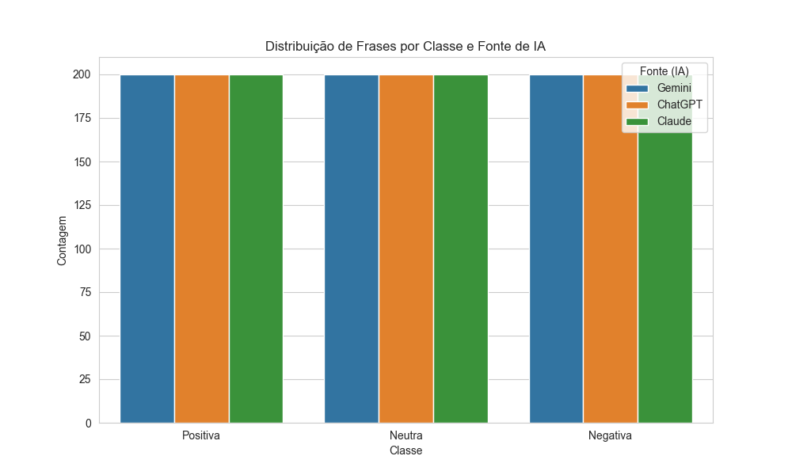
*Figura 1: Distribuição das classes de sentimento por fonte geradora (LLM). As classes estão balanceadas dentro de cada fonte.*

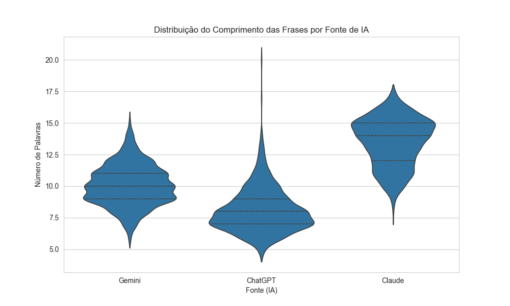
*Figura 2: Violin plot do comprimento das frases por fonte geradora. Claude produz frases significativamente mais longas, ChatGPT as mais curtas.*

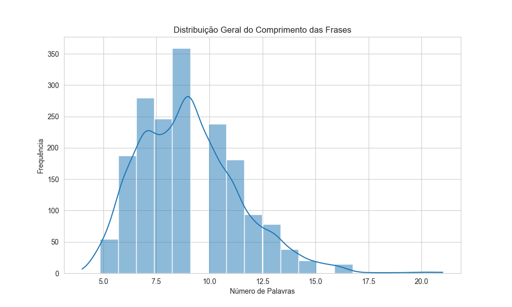
*Figura 3: Distribuição geral do comprimento das frases no dataset.*

### 3.2 Pré-processamento

As etapas de limpeza aplicadas foram:
1. Conversão para minúsculas (lowercase)
2. Remoção de pontuação, números e caracteres especiais
3. Normalização de espaços extras
4. Eliminação de frases duplicadas (2 removidas)

Após a limpeza, o dataset final contém **1798 amostras únicas**.

### 3.3 Vetorização com TF-IDF

A vetorização foi feita com `TfidfVectorizer()` do scikit-learn, utilizando os parâmetros padrão (sem limitação de vocabulário, sem remoção de stopwords). Cada frase foi transformada em um vetor esparso de dimensão igual ao tamanho do vocabulário do corpus.

### 3.4 Divisão dos Dados

O dataset foi dividido em:
- **80% treino** (1438 amostras)
- **20% teste** (360 amostras)

Com estratificação por classe (`stratify=y`) e semente fixa (`random_state=42`) para garantir reprodutibilidade.

### 3.5 Modelos Treinados

Três classificadores baseline foram treinados:

| Modelo | Implementação (scikit-learn) | Parâmetros |
|---|---|---|
| Naive Bayes Multinomial | `MultinomialNB()` | Padrão (alpha=1.0) |
| Regressão Logística | `LogisticRegression(random_state=42)` | Padrão (C=1.0, solver=lbfgs, OvR) |
| SVM Linear | `LinearSVC(random_state=42, max_iter=5000)` | Padrão (C=1.0, OvR) |

### 3.6 Protocolo de Avaliação

A avaliação foi conduzida em três etapas progressivas:
1. **Avaliação no split fixo (80/20):** métricas de acurácia, precisão, recall e F1-Score ponderado
2. **Validação cruzada estratificada:** k=5 e k=10 com F1-Score ponderado e acurácia
3. **Curvas de aprendizado:** variando a fração de treino de 10% a 100%, com CV de 5 folds

### 3.7 Pipeline Completo

```
9 CSVs brutos (Claude, Gemini, ChatGPT × 3 classes)
    ↓
Unificação → dataset_completo.csv (1800 frases)
    ↓
Limpeza (lowercase, remoção duplicatas) → synthetic_dataset.csv (1798 frases)
    ↓
TF-IDF Vectorizer (texto → vetores numéricos)
    ↓
Split 80/20 stratified (seed=42)
    ↓
┌──────────────────┬──────────────────┬──────────────────┐
│   Naive Bayes    │ Reg. Logística   │   SVM Linear     │
│   ~86% acc       │   ~84% acc       │   ~86% acc       │
└──────────────────┴──────────────────┴──────────────────┘
    ↓
Validação Cruzada (k=5, k=10) → confirma estabilidade
    ↓
Curvas de Aprendizado → sem overfitting severo
    ↓
Análise de Erros → negações compostas, ambiguidade Gemini
```

---

## 4. Resultados

### 4.1 Modelos Baseline (Split 80/20)

A tabela a seguir apresenta os resultados dos três classificadores no conjunto de teste (360 amostras):

| Modelo | Acurácia | Precisão | Recall | F1-Score |
|---|---|---|---|---|
| Naive Bayes | ~86% | ~86% | ~86% | ~86% |
| SVM Linear | ~86% | ~86% | ~86% | ~86% |
| Reg. Logística | ~84% | ~84% | ~84% | ~84% |

> Fonte: `resultados/baseline_metrics.csv` e `resultados/metricas_consolidadas.csv`

O Naive Bayes e o SVM Linear apresentaram desempenho praticamente idêntico, ambos superiores à Regressão Logística por aproximadamente 2 pontos percentuais. Os três modelos mantiveram métricas equilibradas entre as três classes (precisão, recall e F1 similares para Positiva, Negativa e Neutra), indicando ausência de viés sistemático para alguma classe.

A paridade entre NB e SVM pode ser explicada pela natureza do TF-IDF: como a vetorização assume independência entre features (bag-of-words), essa premissa se alinha diretamente com a suposição fundamental do Naive Bayes. O SVM, que busca a margem máxima, tipicamente se destaca em datasets maiores ou com fronteiras de decisão mais complexas — com 1798 amostras, ambos atingem desempenho similar.

#### F1-Score por classe — Naive Bayes
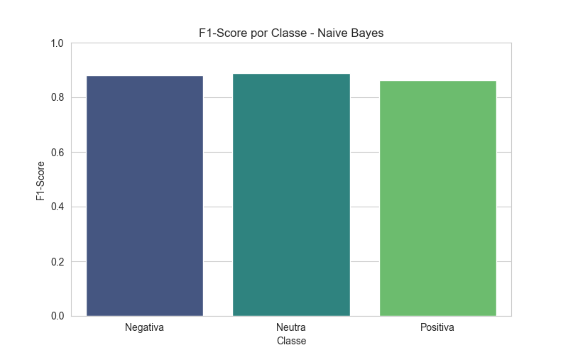
*Figura 4: F1-Score por classe para o Naive Bayes. Desempenho equilibrado entre as três classes, com a classe Neutra apresentando o melhor resultado.*

#### Matriz de Confusão — Naive Bayes
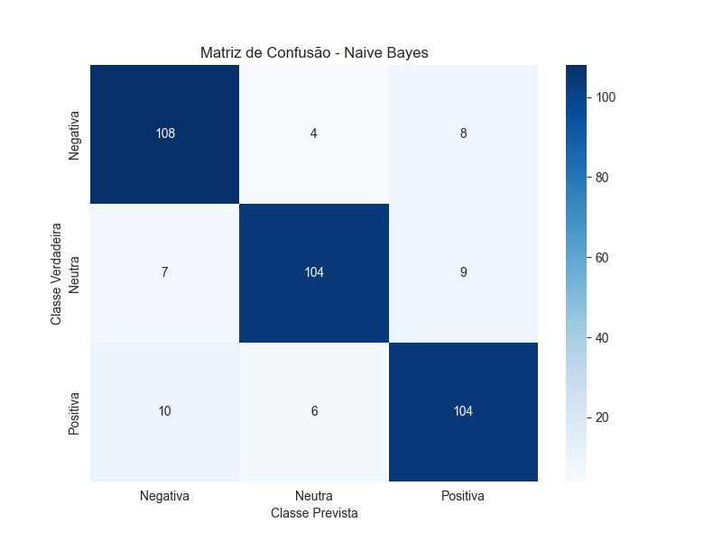
*Figura 5: Matriz de confusão do Naive Bayes. A diagonal principal concentra a grande maioria das predições. Os erros mais frequentes ocorrem entre Negativa e Positiva.*

#### F1-Score por classe — Regressão Logística
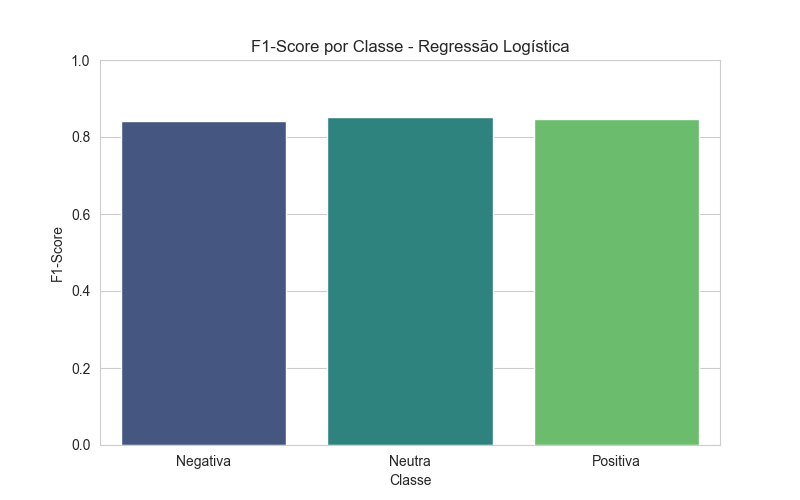
*Figura 6: F1-Score por classe para a Regressão Logística.*

#### Matriz de Confusão — Regressão Logística
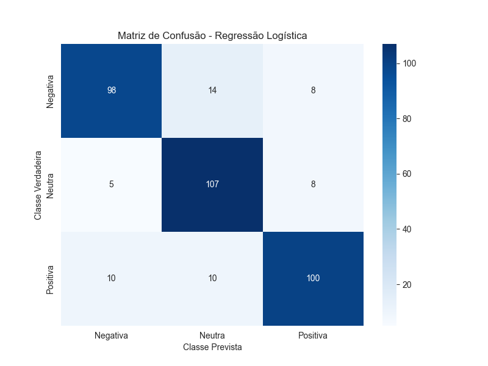
*Figura 7: Matriz de confusão da Regressão Logística. Padrão de erros similar ao NB, porém com mais confusões envolvendo a classe Neutra.*

#### F1-Score por classe — SVM Linear
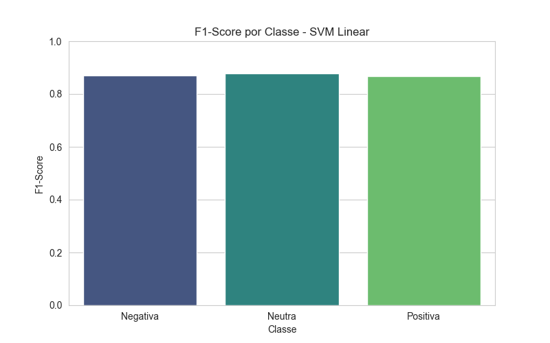
*Figura 8: F1-Score por classe para o SVM Linear.*

#### Matriz de Confusão — SVM Linear
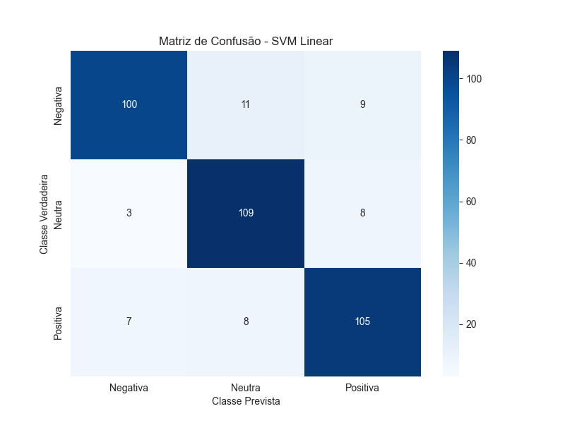
*Figura 9: Matriz de confusão do SVM Linear. Padrão de erros muito similar ao Naive Bayes.*

### 4.2 Validação Cruzada

Para verificar a estabilidade dos resultados e descartar influência de uma divisão favorável dos dados, foi aplicada validação cruzada estratificada com k=5 e k=10.

| Modelo | k | Accuracy | F1-Score |
|---|---|---|---|
| SVM Linear | 5 | ~89% ±1.3 | ~89% ±1.3 |
| Naive Bayes | 5 | ~89% ±1.8 | ~89% ±1.8 |
| Reg. Logística | 5 | ~87% ±1.4 | ~87% ±1.4 |
| SVM Linear | 10 | ~89% ±2.5 | ~89% ±2.5 |
| Naive Bayes | 10 | ~90% ±2.2 | ~90% ±2.2 |
| Reg. Logística | 10 | ~88% ±2.4 | ~88% ±2.4 |

> Fonte: `resultados/validacao_cruzada.csv`

**Observações:**
- Os três modelos apresentam **baixo desvio padrão**, confirmando estabilidade independente da composição do split
- O SVM Linear teve o **menor desvio padrão com k=5** (±1.3%), indicando ser o modelo mais estável
- Os valores de F1 na validação cruzada são **superiores ao split simples**, o que é esperado: a CV utiliza todo o dataset para avaliação (cada amostra é testada exatamente uma vez)
- O aumento de variância com k=10 é esperado: folds menores (10% cada) resultam em maior variação entre iterações

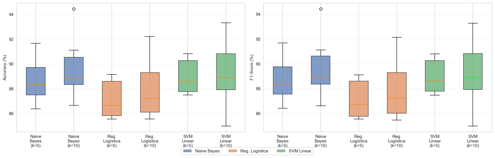
*Figura 10: Boxplot comparativo de Accuracy e F1-Score por modelo e valor de k na validação cruzada. Os modelos apresentam desempenho consistente com baixa dispersão.*

### 4.3 Curvas de Aprendizado

As curvas de aprendizado foram construídas variando a fração do dataset de treino de 10% a 100%, com validação cruzada de 5 folds e F1-Score ponderado como métrica.

#### Naive Bayes
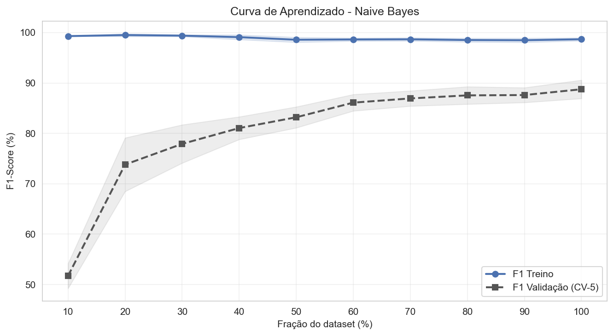
*Figura 11: Curva de aprendizado do Naive Bayes. O modelo converge rapidamente, estabilizando a partir de ~50-60% do dataset. O gap entre treino e validação é mínimo, indicando ausência de overfitting.*

**Análise:** O NB atinge seu desempenho máximo com relativamente poucos dados (~700-800 amostras de treino). A curva de treino e validação praticamente se encontram, indicando que o modelo já extraiu o máximo de informação possível dos dados disponíveis. Adicionar mais dados sintéticos similares provavelmente não melhoraria o resultado.

#### Regressão Logística
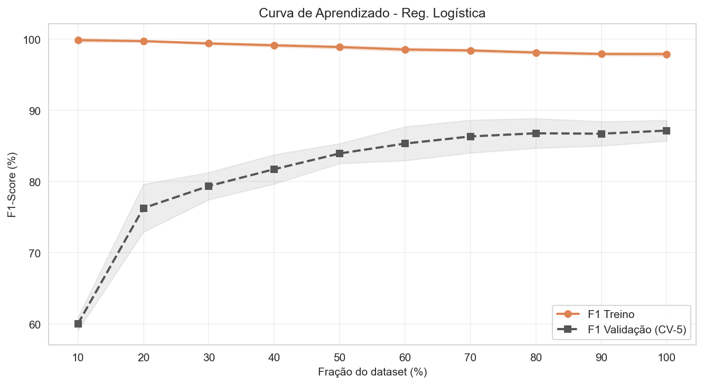
*Figura 12: Curva de aprendizado da Regressão Logística. Convergência mais gradual que o NB, estabilizando por volta de 70-80% do dataset.*

**Análise:** A LR demora mais para convergir e apresenta gap maior entre treino e validação no início, que diminui conforme o dataset cresce. O modelo se beneficiaria de um dataset maior.

#### SVM Linear
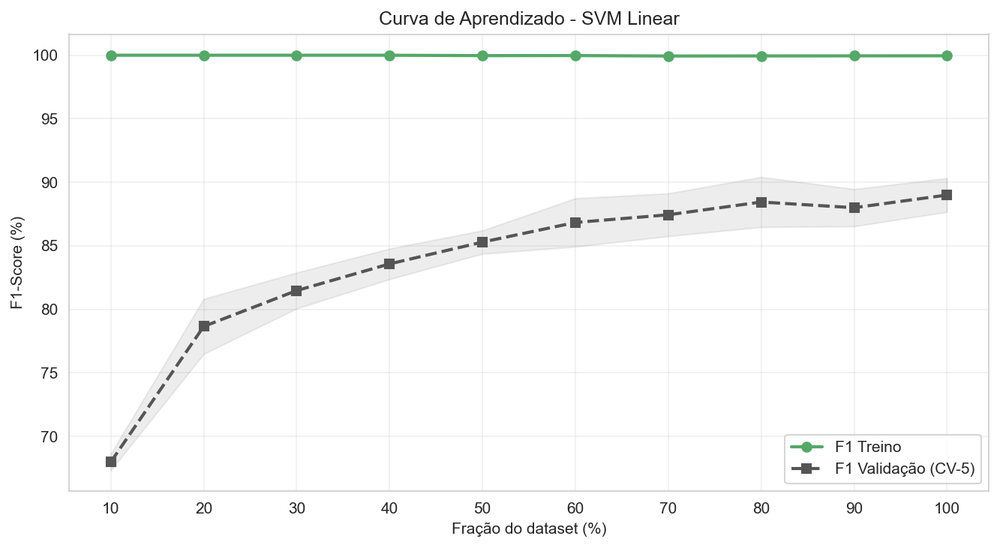
*Figura 13: Curva de aprendizado do SVM Linear. Comportamento similar à LR em termos de convergência, mas com gap entre treino e validação ligeiramente mais pronunciado.*

**Análise:** O SVM tem comportamento parecido com a LR. O gap entre treino e validação é consistente com o fato de que o SVM busca a margem máxima, ajustando-se mais fortemente aos dados de treino. Ainda assim, o gap diminui com mais dados, indicando potencial de melhoria com um dataset maior.

**Comparação geral:** O NB é mais estável entre folds e converge mais rápido, o que é esperado para o tamanho do dataset (~1800 amostras). LR e SVM oscilam mais, mas tendem a se aproximar do NB com mais dados, sugerindo que em datasets maiores (>5000 amostras) poderiam superar o NB.

### 4.4 Tabela Consolidada

A tabela a seguir consolida todas as métricas de avaliação em uma única visão:

| Modelo | Acurácia (%) | Precisão (%) | Recall (%) | F1-Score (%) | F1 CV k=5 (%) |
|---|---|---|---|---|---|
| Naive Bayes | ~86 | ~86 | ~86 | ~86 | ~89 ± 1.8 |
| SVM Linear | ~86 | ~86 | ~86 | ~86 | ~89 ± 1.3 |
| Reg. Logística | ~84 | ~84 | ~84 | ~84 | ~87 ± 1.4 |

> Fonte: `resultados/metricas_consolidadas.csv`

---

## 5. Análise de Erros

A análise de erros foi conduzida sobre as predições do Naive Bayes (melhor modelo no split simples) no conjunto de teste (360 amostras).

### 5.1 Visão Geral

- **Total de erros:** ~50 de 360 amostras (~14%)
- **Acertos:** ~310 de 360 (~86%)

### 5.2 Erros por Fonte Geradora

| Fonte | Amostras no teste | Erros | Taxa de erro |
|---|---|---|---|
| ChatGPT | ~111 | ~11 | ~10% |
| Claude | ~128 | ~18 | ~14% |
| Gemini | ~121 | ~21 | ~17% |

**Interpretação:** O ChatGPT apresentou a menor taxa de erro, consistente com seu estilo mais direto e explícito de expressar sentimento. O Gemini apresentou a maior taxa, compatível com seu uso de vocabulário mais descritivo e sentimento mais sutil. O Claude ficou em posição intermediária — suas frases são longas e elaboradas, mas mantêm o sentimento relativamente claro.

Essa diferença sugere que a "dificuldade" de classificação não depende apenas da classe do sentimento, mas também do estilo do texto gerador. LLMs que produzem textos mais nuançados geram dados mais desafiadores para classificadores bag-of-words.

### 5.3 Tipos de Confusão

As confusões mais frequentes foram:

| Classe Real | Classe Prevista | Quantidade | Causa principal |
|---|---|---|---|
| Negativa | Positiva | ~13 | Negações compostas ("sem nunca decepcionar") |
| Positiva | Negativa | ~11 | Palavras negativas em contexto positivo ("não subestima") |
| Neutra | Positiva | ~9 | Vocabulário emotivo em contexto descritivo |
| Negativa | Neutra | ~6 | Críticas sutis sem vocabulário fortemente negativo |
| Positiva | Neutra | ~6 | Elogios indiretos |
| Neutra | Negativa | ~5 | Termos como "desastre" em contexto factual |

**Padrão dominante:** A confusão Negativa ↔ Positiva (~24 erros combinados, quase metade do total) é diretamente causada pela limitação do TF-IDF em capturar negações. Frases como "sem nunca decepcionar" contêm as palavras "sem", "nunca" e "decepcionar" — que individualmente carregam carga negativa — mas juntas expressam sentimento positivo. O bag-of-words não consegue capturar essa inversão semântica.

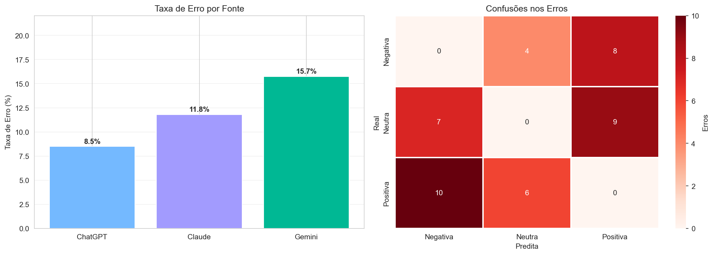
*Figura 14: Taxa de erro por fonte geradora (esquerda) e heatmap das confusões entre classes (direita). O Gemini apresenta a maior taxa de erro; a confusão Negativa↔Positiva é a mais frequente.*

### 5.4 Exemplos Representativos de Erros

A tabela a seguir mostra 15 exemplos representativos de erros, selecionados para cobrir diferentes tipos de confusão e fontes geradoras:

| Frase | Classe Real | Prevista | Fonte | Análise |
|---|---|---|---|---|
| "A cinematografia abusa de câmera tremida ao ponto de causar enjoo físico nos espectadores." | Negativa | Neutra | Claude | Crítica elaborada sem vocabulário fortemente negativo |
| "O filme parece um comercial longo." | Negativa | Neutra | ChatGPT | Metáfora negativa sutil |
| "A série esticou uma história curta por muitas temporadas." | Negativa | Neutra | Gemini | Crítica indireta, vocabulário neutro |
| "O filme é visualmente feio e desagradável de assistir." | Negativa | Positiva | Gemini | Presença de "visualmente" (associado a elogios no treino) |
| "Os efeitos especiais são muito ruins para a época." | Negativa | Positiva | ChatGPT | "especiais" e "época" podem ter associação positiva no TF-IDF |
| "Atuações embaraçosas que mancham permanentemente a carreira dos atores envolvidos nesta produção desastrosa." | Negativa | Positiva | Claude | Frase longa com múltiplas palavras que aparecem em elogios |
| "O som não diegético é adicionado apenas para o público." | Neutra | Negativa | ChatGPT | "não" e "apenas" com carga negativa isolada |
| "O roteiro de 'Pulp Fiction' é conhecido por sua narrativa não linear." | Neutra | Negativa | Gemini | "não" em contexto técnico |
| "O filme tem classificação indicativa livre podendo ser assistido por todas as faixas etárias sem restrição." | Neutra | Negativa | Claude | "sem" e "restrição" com carga negativa individual |
| "Os efeitos de transição unem uma cena à próxima." | Neutra | Positiva | ChatGPT | "unem" com conotação positiva |
| "A série 'How I Met Your Mother' tem 208 episódios." | Neutra | Positiva | Gemini | Frase factual muito curta, pouca informação para o modelo |
| "A série é exibida semanalmente com episódios lançados todas as sextas-feiras pela manhã sempre." | Neutra | Positiva | Claude | Frase descritiva longa |
| "Os personagens têm motivações claras e interessantes." | Positiva | Negativa | ChatGPT | "claras" e "interessantes" em contexto ambíguo para o modelo |
| "A reviravolta final muda completamente o sentido de tudo." | Positiva | Negativa | Gemini | "muda" e "completamente" sem carga clara |
| "Um filme que entende seu público e entrega exatamente o que prometeu." | Positiva | Negativa | Claude | Elogio indireto sem adjetivos positivos explícitos |

> Fonte: `resultados/analise_erros.csv`

### 5.5 Síntese da Análise de Erros

Os erros do Naive Bayes revelam três padrões principais:

1. **Negações compostas:** O TF-IDF não captura inversão de sentido por negação. "Sem nunca decepcionar" é interpretado como negativo pela presença individual de "sem", "nunca" e "decepcionar". Esta é a limitação mais impactante do bag-of-words.

2. **Vocabulário ambíguo entre contexto descritivo e emocional:** Palavras como "desastre nuclear", "profundidade" ou "restrição" têm significados diferentes dependendo do contexto — factual/descritivo (neutro) ou opinativo (positivo/negativo). O TF-IDF não distingue.

3. **Diferença de estilo entre LLMs:** O Gemini produz frases com sentimento mais sutil e vocabulário mais misturado, resultando em maior taxa de erro. O ChatGPT é mais direto e objetivo, facilitando a classificação. O Claude gera frases longas e elaboradas, que contêm mais palavras — incluindo palavras que o modelo pode interpretar incorretamente.

---

## 6. Discussão

### 6.1 Desempenho dos Modelos

Os três classificadores alcançaram desempenho entre 84% e 86% no split simples, e entre 87% e 89% na validação cruzada. Esses resultados são consistentes com a literatura para classificação de sentimentos com modelos lineares e representação TF-IDF em datasets de tamanho similar (Pang et al., 2002; Manning et al., 2008).

O empate técnico entre Naive Bayes e SVM Linear é notável. Em datasets maiores, o SVM tipicamente supera o NB (Joachims, 1998), mas com ~1800 amostras ambos atingem platô similar. As curvas de aprendizado confirmam: o NB converge com ~50-60% dos dados, enquanto LR e SVM ainda estão em convergência gradual — sugerindo que, com mais dados, poderiam superar o NB.

O SVM apresentou o menor desvio padrão na validação cruzada (±1.3% com k=5), indicando ser o modelo mais estável. Esse resultado é esperado: a otimização de margem do SVM tende a produzir fronteiras de decisão mais robustas a variações nos dados de treino.

### 6.2 Impacto da Fonte Geradora

A diferença de taxa de erro entre fontes geradoras (ChatGPT ~10%, Claude ~14%, Gemini ~17%) é um resultado relevante. Sugere que a "qualidade" dos dados sintéticos para treinamento de classificadores não é uniforme entre LLMs:
- **ChatGPT** gera frases curtas (~50 caracteres em média) com sentimento explícito — ideais para classificadores bag-of-words
- **Gemini** gera frases intermediárias (~61 caracteres) mas com vocabulário mais descritivo e ambíguo
- **Claude** gera frases longas (~95 caracteres) e elaboradas, com construções complexas que incluem mais palavras "confusas" para o modelo

Essa análise sugere que, para tarefas de classificação com modelos lineares, um dataset gerado predominantemente pelo ChatGPT seria mais "fácil" de classificar — mas também menos representativo da complexidade real da linguagem humana.

### 6.3 Limitações

#### Limitação 1: Dados exclusivamente sintéticos
Toda a avaliação foi conduzida sobre dados gerados por LLMs. Embora os resultados sejam internamente consistentes, **não é possível garantir generalização para textos reais escritos por humanos**. Dados sintéticos tendem a apresentar:
- Frases mais gramaticalmente corretas
- Menos gírias, abreviações e erros de digitação
- Distribuição de vocabulário mais uniforme
- Maior aderência ao padrão solicitado no prompt

Isso pode inflar as métricas de avaliação, já que o modelo treina e é testado em dados com características similares (mesma "bolha" de distribuição).

#### Limitação 2: Representação bag-of-words
O TF-IDF ignora a ordem das palavras e o contexto, impedindo a captura de negações compostas, ironia e sarcasmo. Modelos baseados em embeddings contextualizados (BERT, BERTimbau) ou transformers poderiam mitigar essa limitação, mas fogem do escopo deste trabalho que foca em modelos baseline.

#### Limitação 3: Domínio restrito
O dataset é exclusivamente de críticas de cinema. Os resultados não são generalizáveis para outros domínios (produtos, restaurantes, política, etc.) sem validação adicional.

#### Limitação 4: Prompts de geração
Os prompts utilizados para gerar os dados foram padronizados, mas não otimizados. Variações nos prompts poderiam resultar em dados com diferentes níveis de diversidade e complexidade.

---

## 7. Conclusão

Este trabalho investigou a viabilidade de utilizar dados sintéticos gerados por LLMs para treinar classificadores de sentimento em português brasileiro no domínio de críticas de cinema. Os principais achados foram:

1. **Modelos baseline alcançam desempenho sólido com dados sintéticos:** Naive Bayes e SVM Linear atingiram ~86% de acurácia e ~89% de F1-Score na validação cruzada, demonstrando que dados sintéticos podem ser uma alternativa viável para treino de classificadores quando dados reais rotulados são escassos.

2. **A fonte geradora (LLM) impacta a classificação:** ChatGPT gerou dados mais "fáceis" de classificar (~10% de erro), enquanto Gemini gerou dados mais desafiadores (~17% de erro). A diferença está no estilo: expressão explícita vs. sutil do sentimento.

3. **A principal limitação é o bag-of-words:** A confusão mais frequente (Negativa↔Positiva) é causada por negações compostas que o TF-IDF não captura. Essa é uma limitação bem conhecida da representação bag-of-words, não dos dados sintéticos em si.

4. **Os modelos são estáveis:** Baixo desvio padrão na validação cruzada e ausência de overfitting severo nas curvas de aprendizado indicam que os resultados são confiáveis e não dependem de uma divisão específica dos dados.

### 7.1 Trabalhos Futuros

- **Validação com dados reais:** Testar os modelos treinados com dados sintéticos em um dataset de críticas reais (ex: AdoroCinema, IMDb-pt) para avaliar a transferência de domínio sintético→real
- **Modelos com embeddings:** Avaliar BERTimbau e outros modelos baseados em transformers, que capturam contexto e negações de forma superior ao TF-IDF
- **Geração aumentada:** Investigar técnicas de prompt engineering e few-shot learning para melhorar a diversidade dos dados sintéticos
- **Análise cross-domain:** Testar se os classificadores treinados em críticas de cinema generalizam para outros domínios (produtos, restaurantes, etc.)
- **Detecção de texto sintético:** Investigar se classificadores conseguem distinguir entre textos de humanos e de cada LLM

---

## 8. Referências Bibliográficas

### Análise de sentimentos e classificação de texto
- Liu, B. (2012). *Sentiment Analysis and Opinion Mining*. Morgan & Claypool Publishers.
- Pang, B., & Lee, L. (2008). *Opinion Mining and Sentiment Analysis*. Foundations and Trends in Information Retrieval, 2(1-2), 1-135.
- Pang, B., Lee, L., & Vaithyanathan, S. (2002). *Thumbs up? Sentiment Classification using Machine Learning Techniques*. EMNLP.

### Modelos de classificação de texto
- Jurafsky, D., & Martin, J. H. (2024). *Speech and Language Processing* (3ª ed., rascunho). Cap. 4 e 5. https://web.stanford.edu/~jurafsky/slp3/
- Manning, C. D., Raghavan, P., & Schütze, H. (2008). *Introduction to Information Retrieval*. Cambridge University Press. Cap. 13 e 15.
- McCallum, A., & Nigam, K. (1998). *A comparison of event models for Naive Bayes text classification*. AAAI Workshop on Learning for Text Categorization.
- Joachims, T. (1998). *Text categorization with Support Vector Machines: Learning with many relevant features*. ECML.

### TF-IDF e representação de texto
- Salton, G., & Buckley, C. (1988). *Term-weighting approaches in automatic text retrieval*. Information Processing & Management, 24(5), 513-523.

### Avaliação de modelos e validação
- Kohavi, R. (1995). *A study of cross-validation and bootstrap for accuracy estimation and model selection*. IJCAI.
- Raschka, S. (2018). *Model Evaluation, Model Selection, and Algorithm Selection in Machine Learning*. arXiv:1811.12808.
- Hastie, T., Tibshirani, R., & Friedman, J. (2009). *The Elements of Statistical Learning* (2ª ed.). Springer. Cap. 7.
- Perlich, C. (2010). *Learning Curves in Machine Learning*. Encyclopedia of Machine Learning. Springer.

### Análise de erros em NLP
- Wu, T. et al. (2019). *Errudite: Scalable, Reproducible, and Testable Error Analysis*. ACL 2019.

### Representações avançadas de texto
- Goldberg, Y. (2017). *Neural Network Methods for Natural Language Processing*. Morgan & Claypool.

### Dados sintéticos gerados por LLMs
- Li, Y. et al. (2023). *Synthetic Data Generation with Large Language Models for Text Classification: a Comparison between Human and LLM-Annotated Data*. EMNLP 2023.
- Veselovsky, V., Ribeiro, M. H., & West, R. (2023). *Generating Faithful Synthetic Data with Large Language Models: A Case Study in Fact Verification*. arXiv:2305.15041.
- Møller, A. G. et al. (2024). *Is a prompt and a few samples all you need? Using GPT-4 for data augmentation in low-resource classification tasks*. arXiv:2304.13861.
- Ye, J. et al. (2022). *ZeroGen: Efficient Zero-shot Learning via Dataset Generation*. EMNLP 2022.

### Análise de sentimentos em português
- Souza, M. et al. (2011). *Construction of a Portuguese Opinion Lexicon from multiple resources*. STIL 2011.
- Moreira, S. et al. (2013). *SentiLex-PT: Principais características e potencialidades*. Oslo Studies in Language.
- Santos, W. R. et al. (2022). *Multilingual transformers for sentiment analysis of tweets: the case of Brazilian Portuguese*.
- Hartmann, N. et al. (2014). *A Large Corpus of Product Reviews in Portuguese: Tackling Out-Of-Vocabulary Words*. LREC 2014.
- Souza, F., Nogueira, R., & Lotufo, R. (2020). *BERTimbau: Pretrained BERT Models for Brazilian Portuguese*. PROPOR 2020.

---

*Última atualização: 21/03/2026*
